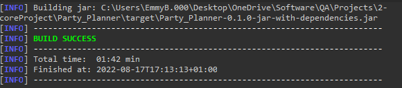
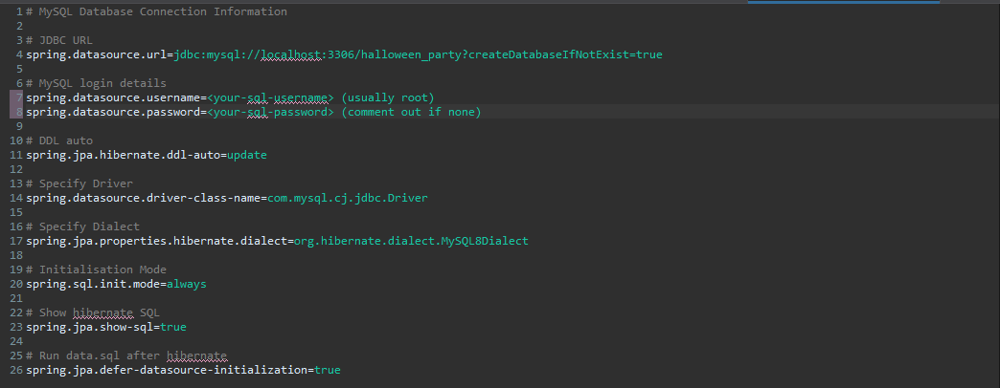
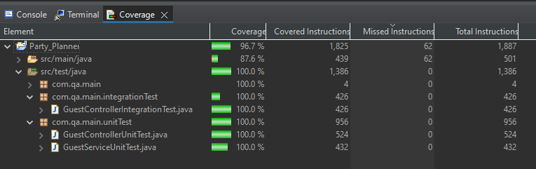
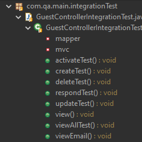
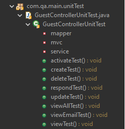
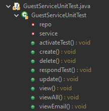
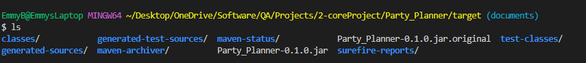
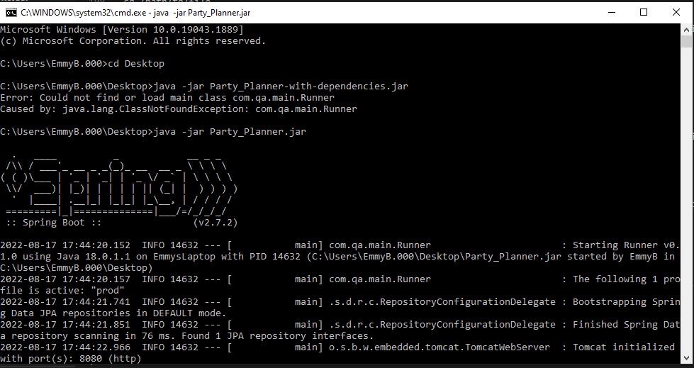
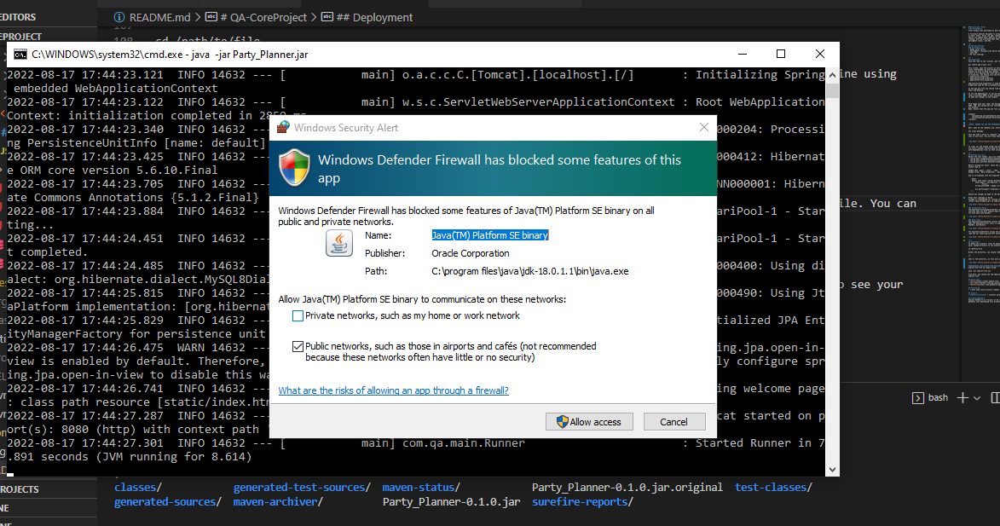
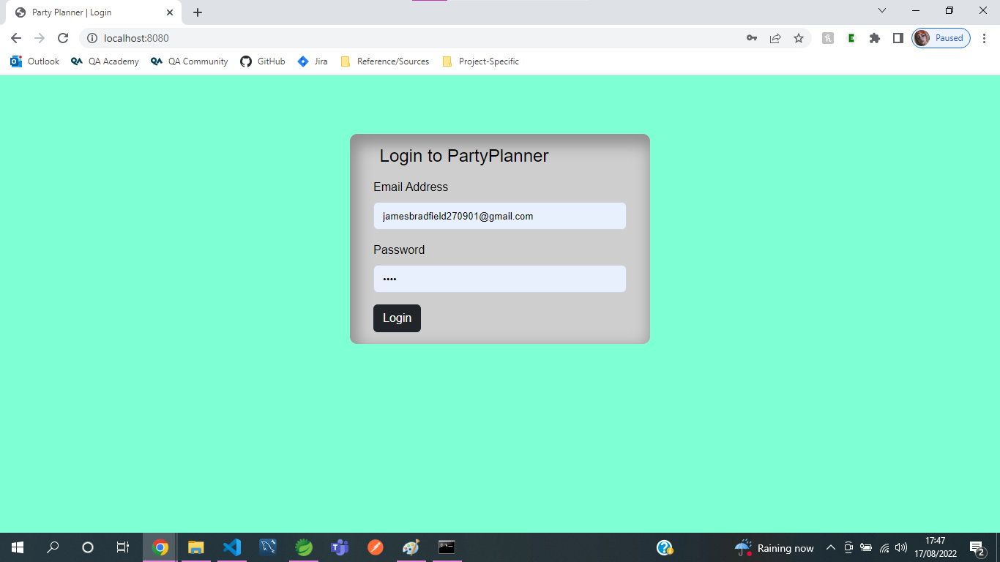

#### Coverage: 95.8%
# QA-CoreProject
*This product was developed as part of my training with QA and meets the scope and requirements for the QA Core Project*

A fullstack website designed to allow users to create an account for themselves as a host, and from there invite guests to their event. Hosts can add, remove, and update guest details as well as creating and editing their event details. Guests can update their details as well as their response to the host. Guest accounts are set as inactive when first created, and are activated when they first log in. The project utilises HTML, CSS (plus BootStrap), JavaScript, SpringBoot (Java), and SQL.

**FOR FULL DOCUMENTATION ON THE SPRINTS, BUILD PROCESS, AND FOR SCREENSHOTS OF SUCH, REFER TO 'Documents/ProgressRecord'**

---
## Getting Started
### Pre-requisites
* MySQL local server
* SpringBoot / Eclipse with Sprint Boot
* Java JDK
* H2 (for testing)

---
## Installing
Fork the repo to your account, and then clone to your local machine using
```
git remote add origin <url>
```
Once cloned, open the project in SpringBoot and you should see all the packages and test classes, as well as two SQL files (testSchema.sql and testData.sql) and the frontend code. 
Should you wish to make any changes, this can be done directly in SpringBoot or you can use a text editor or another IDE (such as for editing the front end or SQL files).
In resources, you should also see three files:
* application.properties
* application-prod.properties
* application-test.properites

Application-prod.properties is used during deployment and connects to a local instance of my SQL. The application-test.properties uses H2 and is automatically set as the active profile when tests are run which require it.

In the pom.xml file you should find all the dependancies including those for packaging the product and running the tests with JUnit and Mocktio.

To use the application prior to packaging, it can be run directly from SpringBoot using "run as SpringBoot application". From there, visit http://localhost:8080 in your browser (shown below) and you should arrive at the landing page index.html should you wish to make any changes to the product. When testing, instead use "run as JUnit test" or "coverage as JUnit test". Changes to the frontend code, located at
```
src/main/resources/static
```
won't be live; either end the application and refresh it from the package manager after changes, or edit your front end in another IDE such as VSCode (with live server extension) and then move it to the SpringBoot project once you're happy with it.


Once happy with your code, the Spring Start Project can be packed into a .jar file. Ensure firstly that any and all HTMl, CSS, and JavaScript are located in src/main/resources/static - otherwise your front end won't be accessible through the packaged project.
Next, ensure that the pom.xml file contains the following plugin for building the project:
```

<plugin>
	<groupId>org.springframework.boot</groupId>
	<artifactId>spring-boot-maven-plugin</artifactId>
</plugin>

```
**NOTE: ENSURE YOU USE THE SPRINGBOOT PLUGIN AND NOT THE MAVAN JAR PLUGIN OR ELSE AN ENTRY POINT WON'T BE FOUND**

Then, open up the command line, ensure you are in the projects working directory, and run
```
mvn clean package
```
This may take a while to complete, and if there are any issues with dependencies, versioning, or the tests not passing it will fail and notify you. You will know that the .jar file has been successfully built when you see:





To clear out the target folder and package the project into a .jar file. Once this is complete, you should see there are two files created: project-name.jar and project-name-with-dependecies.jar - it is advised to always use the with-dependencies file, as that includes the dependencies the project relies on to run. 

---
## Running the Tests
Within the test folder, you will find two packages and three test classes
* com.qa.main.integrationTest.GuestControllerIntegrationTest
* com.qa.main.unitTest.GuestControllerUnitTest
* com.qa.main.unitTest.GuestServiceUnitTest

Before running any tests, check the testData.sql file and ensure the test objects match. If unchanged, the data file should read as
```
INSERT INTO `guest` (`host`, `name`, `email`, `password`, `active`, `attend`, `accom`, `park`)
VALUES (true, 'Emily Bradfield', 'emily-bradfield@outlook.com', 'root', true, true, false, false); 
```
And so corresponds with the expected objects in several tests, eg:
```
	@Test
	public void view() throws Exception {
		Guest guest = new Guest(1L, true, "Emily Bradfield", "emily-bradfield@outlook.com", "root", true, true, false,
				false);
		String guestJSON = mapper.writeValueAsString(guest);

		mvc.perform(get("/view?id=1").contentType(MediaType.APPLICATION_JSON)).andExpect(content().json(guestJSON));
	}
```
Should any changes be made to the data file, they must be replicated in the test class, and vice versa.
Additionally, ensure the application-prod.properties file is updated to match the username and password used for *your* local instance of my SQL, as shown below:

 (usually root) and spring.datasource.password = <your-sql-password> (comment out if none)">

Final test coverage is 95.8%
EclEmma is recommended for running coverage tests, and can be installed from the Eclipse marketplace. Click [here](https://www.eclemma.org/) to read more on EclEmma and coverage.



### Integration Tests
The GuestControllerIntegrationTest consists of tests for create, viewAll, view, update, respond, activate, and delete and confirms that any HTTP request made of such is persisted to the database and matches an expected object. These tests are run with JUnit and MockMvc.



### Unit Tests
The GuestControllerUnitTest allows the above tests to be run with a mocked return from the GuestServer class, ensuring that the GuestController class is operating as expected and returning the correct result. These tests are run with JUnit, MockMvc, and Mockito



The GuestServiceUnitTest allows the GuestService class to be assessed as an independant unit, mocking the return from the repo and not requiring any HTTP protocal. These tests are run with JUnit and Mockito.



---
## Deployment
To deply this project, start by opening your preferred command line such as windows Command Prompt or Linux CLI. From here, change directory to the project location using
```
cd /path/to/file
```
Within the directory, you should find the .jar file you just packaged - you can check from the command line using
```
ls
```
when in the directory, as this will allow you to see all files present



Additionally, you should find one with .jar and one with .jar.original - we will be executing the .jar file. You can execute the file by simply using: 
```
java -jar name-of-file.jar
```
You should see the SpringBoot logo followed by a lot of information about its startup in your console 



You may also get a pop up requesting permision to make changes; you can accept this



Once SpringBoot has finished it's startup process, you can navigate to http://localhost:8080 to see your website live:



**Note: if you have renamed your landing page and it is not index.html or home.html, instead navigate to:**
```
http://localhost:8080/file-name.html
```
**If you are running your server on localhost, but any port other than 8080, ensure you change the url to also reflect this**

## Built with
* [Maven](https://maven.apache.org/) - Dependency management
* [SpringBoot](https://spring.io/projects/spring-boot) - API
* [BootStrap](http://www.getbootstrap.com) - CSS Styling

## Versioning
* I have used [Semver](http://semver.org/) versioning

## Authors
* **Emily Bradfield** - *initial work* - [emmy-bradfield](https://www.github.come/emmy-bradfield)

## Acknowledgements
Special thanks to my trainers at QA over the past few weeks, in particular Anoush Lowton, for the continual support and guidance with developing this project.
